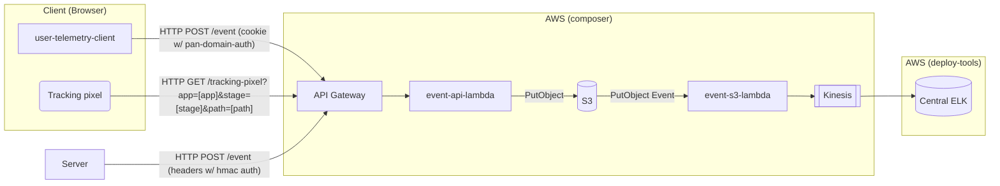

# editorial-tools-user-telemetry-service

A service to receive telemetry events and pass them on to a kinesis stream. Designed to be used across the Guardian's
internal tooling to help the Journalism stream gather data about tool usage. The package is published
as [@guardian/user-telemetry-client](https://www.npmjs.com/package/@guardian/user-telemetry-client).

The service uses [pan-domain-authentication](https://github.com/guardian/pan-domain-authentication) to authenticate
requests from clients, and [hmac](https://github.com/guardian/hmac-headers) to authenticate requests from servers.



## Sending tracking events

### User Telemetry Client

Events are intended to be sent via the [User Telemetry Client package](./projects/user-telemetry-client), using
the [IUserTelemetryEvent](./projects/definitions/IUserTelemetryEvent.ts) interface.

For example:

```TypeScript
const telemetryService = new UserTelemetryEventSender(url);

telemetryService.addEvent(exampleEvent);
```

Events are accumulated and sent asynchronously, with a retry mechanism in case of issues.

If events need to be sent synchronously, the `flushEvents` method can be used.

```TypeScript
await telemetryService.flushEvents();
```

### Tracking Pixel

Alternatively, basic visits to a page can be identified using the `/tracking-pixel` endpoint. This can be requested
either via a script or an HTML img element.

Script:

```JavaScript
const image = new Image();
image.src = "https://[telemetry-backend-domain]/tracking-pixel?app=[app]&stage=[stage]&path=[path]";
```

Image Tag:

```HTML

```


## Creating the stack

In `/cdk`, run `npm i` to install dependencies, and `npm run synth` to generate cloudformation for the stack.

## Deploying the stack

To release changes, deploy the `editorial-tools-user-telemetry-service` project in Riffraff.

## Creating and deploying the package

Deploying the package should be handled automatically when changes are made to the user-telemetry-client subproject. The
merge commit for the PR should use the [conventional commits syntax](https://www.conventionalcommits.org/en/v1.0.0/).

## Rotating the HMAC key used by machine clients

The API allows users to authenticate using a HMAC header compatible with
[guardian/panda-hmac](https://github.com/guardian/panda-hmac). It uses a
secret key which is stored in AWS secrets manager, this is rotated regularly.

A script is available in this repository to facilitate updating this key:

```
./scripts/update-event-api-hmac-secret.sh
Preparing to update HMAC key in AWS SecretsManager

Previous key version created at: 2023-05-17T16:38:29.941000+01:00
Current key version created at: 2023-05-17T16:38:47.018000+01:00

WARNING: Changing this key may prevent machine clients from sending metrics!
~~ Machine client keys will need to be updated manually.
~~ Be aware the previous key will continue to work for 5 days, unless rotated again.

Are you sure you want to do this? [Yy]y
Done!
```

**You will have 5 days to update machine clients** that use this key, contact
the [Editorial Systems Development (ESD)](https://github.com/orgs/guardian/teams/esd) team before doing this so that the
can ensure they new key is
rolled out.
